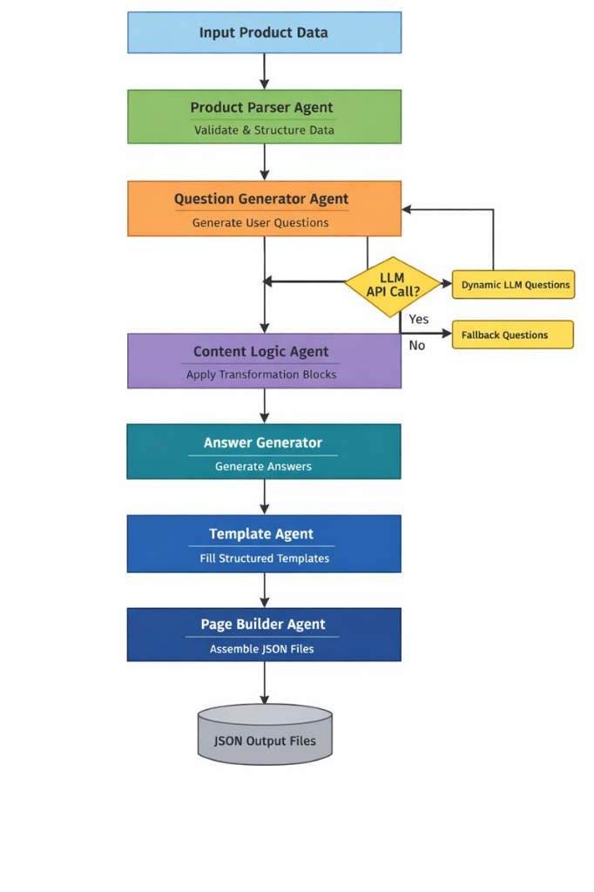

<h1>Multi-Agent Content Generation System</h1>

<h2>Overview</h2>

This project implements a production-style multi-agent automation system that generates
structured, machine-readable product content from a small input dataset.
The system produces FAQ, Product, and Comparison pages in JSON format using modular agents
coordinated through a lightweight orchestration layer.

The focus of this project is system design, agent boundaries, and automation.
LangChain is used only for orchestration and LLM interaction, while all business logic,
templates, and transformations are implemented in pure Python.

<h2>Key Capabilities</h2>
<ul>
  <li>Modular multi-agent architecture with clear responsibilities</li>
  <li>End-to-end automated pipeline triggered by a single command</li>
  <li>Reusable logic blocks for content transformation</li>
  <li>Template-driven generation for consistent structured outputs</li>
  <li>Machine-readable JSON outputs suitable for downstream systems</li>
  <li>Execution metadata for traceability and debugging</li>
</ul>

<h2>System Architecture</h2>

The system operates as a staged pipeline with clear boundaries between agents.

<pre>
Input Data
   ↓
ProductParserAgent
   ↓
QuestionGeneratorAgent
   ↓
ContentLogicAgent
   ↓
AnswerGenerator
   ↓
TemplateAgent
   ↓
PageBuilderAgent
   ↓
JSON Outputs
</pre>

<h2>Agents</h2>

<h3>ProductParserAgent</h3>
<ul>
  <li>Validates raw product data</li>
  <li>Normalizes and structures fields into a standard internal format</li>
</ul>

<h3>QuestionGeneratorAgent</h3>
<ul>
  <li>Dynamically generates at least 15 user questions</li>
  <li>Categorizes questions into Informational, Usage, Safety, Purchase, and Comparison</li>
  <li>Uses an LLM with a deterministic fallback for reliability</li>
</ul>

<h3>ContentLogicAgent</h3>
<ul>
  <li>Routes data through reusable logic blocks</li>
  <li>Applies structured transformations to product attributes</li>
</ul>

<h3>AnswerGenerator</h3>
<ul>
  <li>Generates contextual answers for FAQ questions</li>
  <li>Uses only the provided product data</li>
</ul>

<h3>TemplateAgent</h3>
<ul>
  <li>Fills predefined templates for FAQ, Product, and Comparison pages</li>
  <li>Ensures consistent output structure</li>
</ul>

<h3>PageBuilderAgent</h3>
<ul>
  <li>Assembles final page objects</li>
  <li>Writes validated JSON files to the output directory</li>
</ul>

<h2>Logic Blocks</h2>
<ul>
  <li><strong>benefits_block.py</strong> – Structures product benefits</li>
  <li><strong>usage_block.py</strong> – Formats usage steps and guidance</li>
  <li><strong>safety_block.py</strong> – Structures safety notes and precautions</li>
  <li><strong>comparison_block.py</strong> – Generates a structured comparison with a fictional competitor</li>
</ul>

<h2>Running the Pipeline</h2>

<pre>
python run_pipeline.py
</pre>

<h2>Output</h2>
<ul>
  <li><code>faq.json</code> – FAQ page with categorized questions and answers</li>
  <li><code>product_page.json</code> – Structured product details</li>
  <li><code>comparison_page.json</code> – Feature-by-feature comparison with a fictional product</li>
</ul>

All outputs are valid JSON and designed for direct consumption by other systems.

<h2>Execution Metadata</h2>

<pre>
{
  "_meta": {
    "generated_by": "PageBuilderAgent",
    "agents_involved": [
      "ProductParserAgent",
      "QuestionGeneratorAgent",
      "ContentLogicAgent",
      "AnswerGenerator",
      "TemplateAgent",
      "PageBuilderAgent"
    ],
    "execution_timestamp": "2025-12-25T11:49:29.212033",
    "pipeline_version": "1.0.0"
  }
}
</pre>

<h2>Project Structure</h2>

<pre>
kasparro-ai-agentic-content-generation-system-karthik/
├── agents/
├── logic_blocks/
├── templates/
├── orchestrator/
├── outputs/
├── docs/
├── run_pipeline.py
├── requirements.txt
├── .env.example
└── README.md
</pre>

<h2>Documentation</h2>

Detailed system design and architectural reasoning are available in
<code>docs/projectdocumentation.md</code>.

<h2>License</h2>

This project is created for demonstrating applied AI system design and agentic automation.

