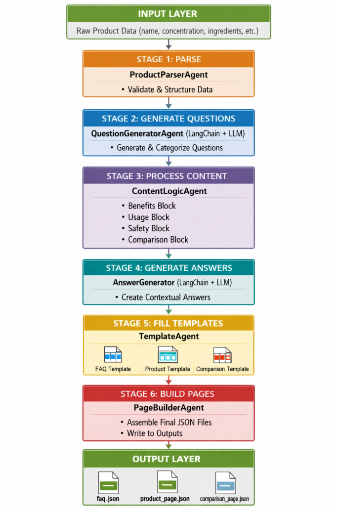

# Multi-Agent Content Generation System

## Problem Statement

Creating structured, consistent, and high-quality marketing content (FAQs, product pages, comparisons) for a large inventory of products is time-consuming and error-prone when done manually. Ensuring that all content is accurate, SEO-friendly, and follows a specific brand voice requires significant human effort. Moreover, maintaining consistency across different content types (safety warnings, usage instructions) is difficult at scale without automation.

## Solution Overview

The **Kasparro AI Agentic Content Generation System** serves as an intelligent automation pipeline that transforms raw product data into fully formatted, ready-to-publish content. By orchestrating specialized AI agents, the system automates the generation of:

- **Comprehensive FAQs** with context-aware answers.
- **Detailed Product Pages** including benefits, usage instructions, and safety warnings.
- **Competitive Comparison Pages** against fictional or real competitors.

The solution leverages Large Language Models (LLMs) via LangChain for creative tasks (question generation, answer synthesis) while using deterministic Python logic for structural consistency and safety compliance.

## Scopes & Assumptions

### Scope
- **Input**: Structured JSON product data.
- **Output**: Three distinct JSON files (FAQ, Product Page, Comparison Page) per product containing execution metadata.
- **Agents**: Parser, Question Generator, Content Logic, Answer Generator, Template Filler, Page Builder.
- **Integration**: Supports OpenAI (GPT-3.5/4) and Google Gemini (gemini-2.5-flash) models.

### Assumptions
- Input data is well-formed and contains essential fields (name, description, features).
- Valid API keys for OpenAI or Google Gemini are provided in the environment.
- The system runs in a Python 3.8+ environment.
- Generated content is strictly based on provided product data to minimize hallucinations.

## System Design



The system is designed as a **staged pipeline** where each agent performs a specific transformation on the data. This modular approach ensures that the system is easy to debug, test, and extend.

### Core Components

- **Orchestrator (`pipeline.py`)**: The central nervous system that manages the flow of data between agents. It ensures that each stage receives the necessary context and handles errors gracefully.
- **LLM-Powered Agents**:
  - `QuestionGeneratorAgent`: Crafting user-centric questions using few-shot prompting.
  - `AnswerGenerator`: Synthesizing product data into concise, accurate answers.
- **Deterministic Logic Agents**:
  - `ProductParserAgent`: Enforces data integrity at the entry point.
  - `ContentLogicAgent`: Executes complex business rules (e.g., safety checks, benefit extraction) without LLM overhead.
- **Page Assembly Agents**:
  - `TemplateAgent`: Maps processed data to visual/structural components.
  - `PageBuilderAgent`: Finalizes the output and attaches execution telemetry.

### Data Flow

1. **Ingestion**: Raw product JSON is validated and transformed into a standard `ProductData` object.
2. **Expansion**: The system generates a broad set of queries and scenarios based on the product attributes.
3. **Refinement**: Content blocks are processed through specialized logic gates (Safety, Benefits, Comparison).
4. **Synthesis**: LLMs generate natural language responses based on the refined data.
5. **Finalization**: Data is serialized into multiple JSON formats with attached execution metadata.

## Pipeline Stages

The system processes content through 6 sequential stages:

### Stage 1: Parse
**Agent**: `ProductParserAgent`
- Validates and structures raw product data
- Pure Python implementation

### Stage 2: Generate Questions
**Agent**: `QuestionGeneratorAgent` (LangChain + LLM)
- Generates categorized user questions
- Categories: Informational, Usage, Safety, Purchase, Comparison

### Stage 3: Process Content
**Agent**: `ContentLogicAgent`
- Routes data through logic blocks:
  - `benefits_block` - Structured benefits
  - `usage_block` - Step-by-step instructions
  - `safety_block` - Warnings and precautions
  - `comparison_block` - Fictional competitor generation

### Stage 4: Generate Answers
**Agent**: `AnswerGenerator` (LangChain + LLM)
- Creates contextual answers for FAQ questions
- Uses product data + processed content

### Stage 5: Fill Templates
**Agent**: `TemplateAgent`
- Populates 3 templates in parallel:
  - FAQ Template
  - Product Template
  - Comparison Template

### Stage 6: Build Pages
**Agent**: `PageBuilderAgent`
- Assembles final JSON files
- Writes to `outputs/` directory
- Injects execution metadata (see below)

## Project Structure

```
├── agents/                    # Specialized agents
│   ├── product_parser_agent.py
│   ├── question_generator_agent.py
│   ├── content_logic_agent.py
│   ├── template_agent.py
│   └── page_builder_agent.py
├── logic_blocks/              # Reusable transformation functions
│   ├── benefits_block.py
│   ├── usage_block.py
│   ├── safety_block.py
│   └── comparison_block.py
├── templates/                 # Page structure definitions
│   ├── faq_template.py
│   ├── product_template.py
│   └── comparison_template.py
├── orchestrator/              # Pipeline coordination
│   ├── pipeline.py
│   ├── answer_generator.py
│   └── execution_context.py   # Metadata tracking
├── outputs/                   # Generated JSON files
│   ├── faq.json
│   ├── product_page.json
│   └── comparison_page.json
└── run_pipeline.py            # Main entry point
```

## Usage

```bash
# Install dependencies
pip install -r requirements.txt

# Set API Key (creates .env file)
# Option 1: OpenAI
# OPENAI_API_KEY=your_key_here

# Option 2: Google Gemini (uses gemini-2.5-flash)
# GOOGLE_API_KEY=your_key_here

# Run pipeline
python run_pipeline.py
```

## Output Files

All outputs are JSON files in the `outputs/` directory:

- **faq.json** - FAQ page with categorized Q&A
- **product_page.json** - Product details with benefits, usage, safety
- **comparison_page.json** - Side-by-side product comparison

## Agent Execution Metadata Feature

Each output file includes a `_meta` object tracking pipeline execution:

```json
{
  "page_type": "faq",
  "product_name": "GlowBoost Vitamin C Serum",
  "questions": [...],
  "_meta": {
    "generated_by": "PageBuilderAgent",
    "agents_involved": [
      "ProductParserAgent",
      "QuestionGeneratorAgent",
      "ContentLogicAgent",
      "AnswerGenerator",
      "TemplateAgent",
      "PageBuilderAgent"
    ],
    "execution_timestamp": "2025-12-25T11:49:29.212033",
    "pipeline_version": "1.0.0"
  }
}
```

**Implementation**:
- `ExecutionContext` class tracks agent execution order
- Pipeline records each agent as it executes
- `PageBuilderAgent` injects metadata before saving JSON
- Non-invasive: no changes to existing logic or templates

## Key Design Principles

1. **LangChain for Coordination Only**: Used only for agent orchestration and LLM interaction, not business logic.
2. **Pure Python Logic**: All transformations and templates in standard Python.
3. **Single Responsibility**: Each agent has one clear purpose.
4. **Reusable Components**: Logic blocks shared across templates.
5. **Stateless Agents**: No internal state between calls.
6. **Automated Execution**: Single command runs entire pipeline.

## LangChain Usage

LangChain is used **only** for:

- `QuestionGeneratorAgent` - LLM interaction (switching between `ChatOpenAI` and `ChatGoogleGenerativeAI`)
- `AnswerGenerator` - LLM interaction (switching between `gpt-3.5-turbo` and `gemini-2.5-flash`)

Everything else is pure Python for maintainability and testability.
